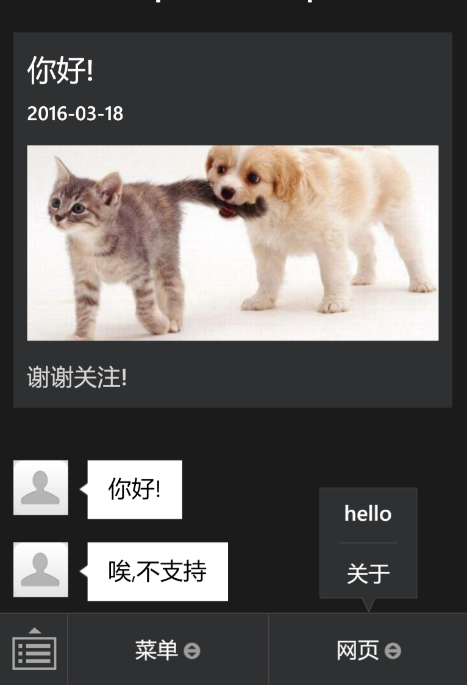
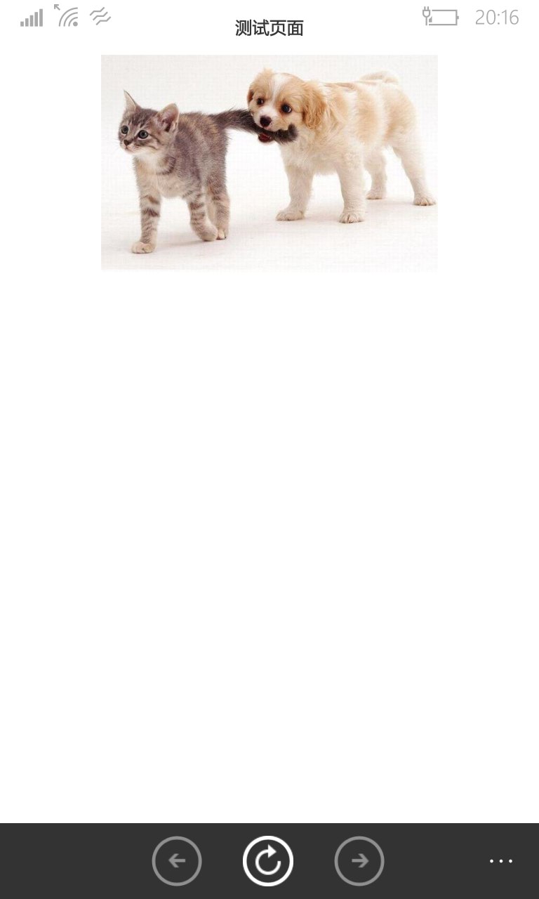

weichat-nodejs
===
本项目是使用 Nodejs 进行微信公众平台开发,是个人学习微信公众平台开发的实验项目.因为个人技术能力有限,所以项目中可能会存在一些问题, 希望各位能帮忙指出存在的问题.

实现了如下功能
---
+ 服务器接入
+ 获取接口调用凭据
+ 自定义菜单的创建
+ 客服接口的文本消息和图文消息的发送
+ 关注事件和点击自定义菜单事件的处理

部署
---

###服务器

####个人服务器
自己随意处理,只是注意微信必须使用 `80` 端口

####百度BAE

1. 注册, 注册的时候需要上传身份证的正面和背面
2. 创建一个 BAE 基础版(最低配置只需要2角钱一天)
3. 复制 BAE 的 git 地址上传即可(端口必须是 18080)

####ngrok

在网上下载一个 ngrok 并运行,把生成的链接地址填入测试帐号页面即可

###测试帐号
1. [申请测试帐号](http://mp.weixin.qq.com/debug/cgi-bin/sandbox?t=sandbox/login)
2. 将接口配置的 URL 填写为你自己的服务器地址
3. 填入 token

###配置
1. 将测试帐号页面上的 appId 和 appsecret 复制到 config/weichat_config.js 里面替换掉相应的值
2. 替换 config/msg_config.js 里面的链接地址为你的地址
3. 替换 config/menu_config.js 里面的链接地址为你的地址

###发布
上传到你的服务器,运行就行了

###运行
使用微信扫描测试帐号页面下方的二维码关注你的测试帐号即可

###截图

